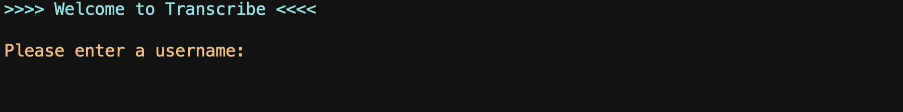
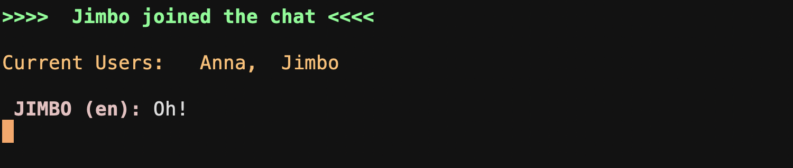

# Project Transcribe
---------------------------------
## Links

* [Project link](https://n14-transcribe.herokuapp.com)

* [Travis CI](https://www.travis-ci.com/401n14/midTerm)

* [Documentation](https://n14-transcribe.herokuapp.com/docs/)

---------------------------------
## Web Application

The application is a communication platform for realtime chat between two or more users. We utilized NodeJS, JavaScript, Google Translate API, and MongoDB. 

Users will be able to create a username, specify a language, and then enter a group chat. They can chat through command line to other users in the same chat server. We have utilized Google Translate API to translate one user's preferred language to the other user's preferred language. Essentially, users can communicate easily and effectively in multiple languages at the same time. 

We have expanded this project to persist messages into a mongo database. We display the last 5 messages in the chat server to a user upon initial login. 

---------------------------------

## Tools Used

- NodeJS
- Express 
- Socket.io
- Google Translate API
- Mongo Database
- Chalk
- Readline 

---------------------------------

## Getting Started

Clone this repository to your local machine.
```
$ git clone https://github.com/401n14/midTerm.git
```
Once downloaded, use your terminal to enter commands. 
```
cd midTerm
`npm i`
```
Install all dependencies needed for the project.
```
`node chat/chat.js`
```
Start chatting

---------------------------------

## Usage

### Enter a username


### Type in your preferred language


### The last 5 messages from the chat will be displayed


### Start Chatting!


### Messages will display name of sender and their language


---------------------------
## Data Flow (Frontend, Backend, REST API)
***[Add a clean and clear explanation of what the data flow is. Walk me through it.]***


---------------------------
## Data Model

### Overall Project Schema
***[Add a description of your DB schema. Explain the relationships to me.]***


---------------------------


## Authors
Nadya Ilinskaya
James Dunn
Anna Li
Morgan T Shaw
Martin Balke
Meron Sibani

------------------------------
