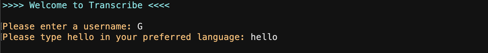
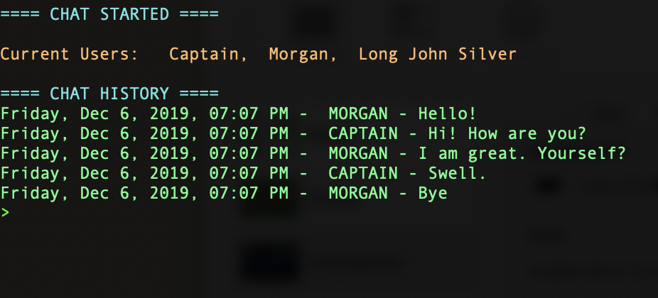
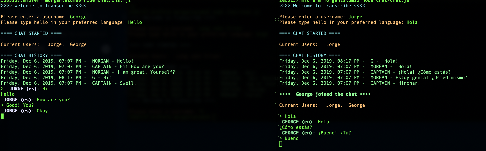

# Project "Transcribe"
## Production Links

* [Server](https://transcribe-jamm.herokuapp.com) 
* [Client](https://www.npmjs.com/package/transcribe-chat)
* [Documentation](https://transcribe-jamm.herokuapp.com/docs/)

## Node Application

The application is a communication platform for realtime chat between two or more users. We utilized NodeJS, JavaScript, Google Translate API, and MongoDB. 

Users are able to create a username, specify a language, and then enter a group chat. They can chat through command line to other users in the same chat server. We have utilized Google Translate API to translate one user's preferred language to the other user's preferred language. Essentially, users can communicate easily and effectively in multiple languages at the same time. 

We have expanded this project to persist messages into a mongo database. We display the last 5 messages in the chat server to a user upon initial login. 

## Main Dependencies

- [NodeJS](https://nodejs.org/en/)
- [Express](https://expressjs.com/) 
- [Socket.io](https://socket.io/)
- [Google Translate API](https://www.npmjs.com/package/google-translate)
- [MongoDB](https://www.mongodb.com/) 

## To install application
* Make sure you have [NodeJS](https://nodejs.org/en/) installed
* Run npm command:
```
npm install -g transcribe-chat
```
* Type command below in your terminal bash prompt to start [Transcribe-chat](https://www.npmjs.com/package/transcribe-chat) application

```
ts-chat
``` 
* Chat up!

## Usage

### Enter a username


### Type in your preferred language


### The last 5 messages from the chat will be displayed


### Start Chatting!


### Messages will display name of sender and their language


### Messages will be translated and displayed based on the user's language


## UML Diagram (Frontend, Backend, REST API)


## Authors
* Nadya Ilinskaya
* James Dunn
* Anna Li
* Morgan T Shaw
* Martin Balke
* Meron Sibani

aka **nightJAMMM team**

 <center>© CodeFellows | 2019</center>
